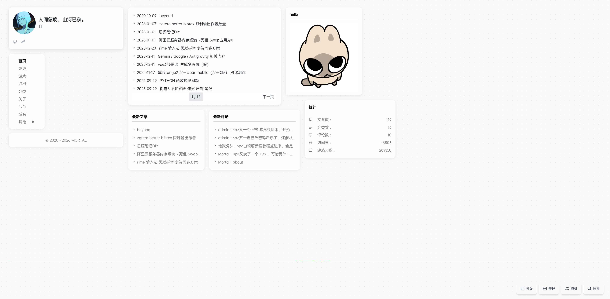
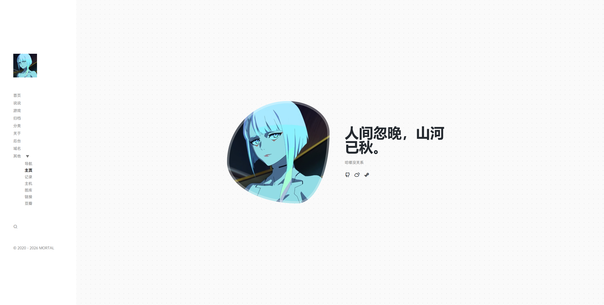
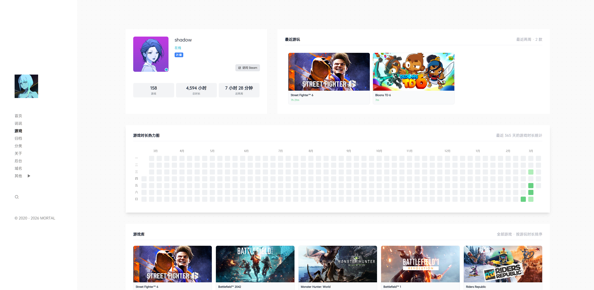
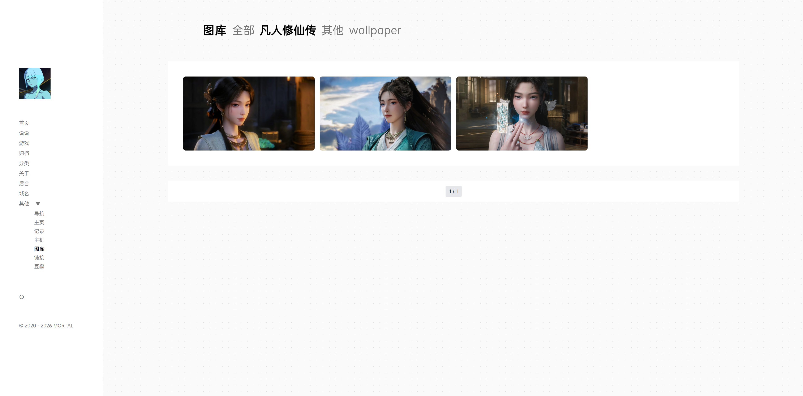

# Halo Theme Daisym

[](https://github.com/ting1e/halo-theme-daisym)
[](https://halo.run)

`theme-daisym` 是一款简洁优雅的纯色 Halo2 主题。

## 📍 预览
* **演示地址**：[elapse.cc](https://elapse.cc)

### 首页布局多样化
| 自由拖动首页 (Desktop) | 个人介绍首页 (Intro) |
| :---: | :---: |
|  |  |

### 插件深度适配
| Steam 插件适配 | 相册/图库适配 |
| :---: | :---: |
|  |  |

## ✨ 功能特性

- **三种主页模式**：支持 `个人主页`、`文章列表`、`桌面布局` (自由拖拽组件) 自由切换。
  - 桌面布局仅在桌面端显示，移动端显示文章列表。
- **瞬间 (Moments) 增强**：支持 `合并` 与 `分开` 两种显示样式。
- **定制**：
  - 侧边栏子块自由开关（标语、最新文章、最新评论、统计）。
  - 支持社交资料显示（Github, Weibo, WeChat, QQ, Bilibili, Steam 等）。
  - 内置文章目录 (TOC) 与快速编辑功能。
- **页面适配**：
  - 所有基础页面，如文章列表、文章详情、分类、归档。
  - Steam 信息展示
  - 图库管理
  - 瞬间
  - 链接管理


## 📦 内置资源

- **JavaScript 库**：
  - [jQuery](https://jquery.com/)：基础 DOM 操作。
  - [ECharts](https://echarts.apache.org/)：用于数据图表展示。
  - [Fancybox](https://fancyapps.com/fancybox/)：图片灯箱效果。
  - [Highlight.js](https://highlightjs.org/)：代码高亮。
  - [InstantClick](http://instantclick.io/)：实现单页应用级别的局部刷新体验。
- **CSS & 字体**：
  - [TailwindCSS](https://tailwindcss.com/)：现代 CSS 框架。
  - [RemixIcon](https://remixicon.com/)：开源图标库。
  - **OPPOSans 字体**：内置全套 OPPO 自研字体，提升阅读体验。

## ⚙️ 主题配置

您可以在 Halo 控制台的「主题设置」中进行以下配置：

- **基础设置**：主页视图切换、瞬间页面样式、建站时间等。
- **个人信息**：精细化头像尺寸选择，丰富的社交链接配置。
- **桌面布局**：针对桌面视图开启/关闭个人简介、文章列表、最新瞬间、统计等模块。
- **侧边栏**：自定义标语标题及内容。
- **页面模板**：
  - `page_self.html`: 个人页面
  - `page_listall.html`: 文章列表
  - `page_article.html`: 文章详情
  - `page_domain.html`: 域名列表

## 🔌 推荐插件

为了获得最佳体验，建议安装并启用以下插件：

- [图库管理](https://github.com/halo-sigs/plugin-photos)
- [瞬间](https://github.com/halo-sigs/plugin-moments)
- [链接管理](https://github.com/halo-sigs/plugin-links)
- [搜索组件](https://github.com/halo-sigs/plugin-search)
- [评论组件](https://github.com/halo-sigs/plugin-comment-widget)
- [Steam 插件](https://github.com/halo-sigs/plugin-steam)
- [RSS](https://github.com/halo-sigs/plugin-rss)

## 💡 进阶说明

### 页面宽度调整
若需修改页面在大屏下的宽度，可在 **设置 -> 代码注入 -> 全局 head 标签** 中添加以下代码：

```css
<style>
  /* 调整超大屏幕下的主容器宽度 */
  @media (min-width: 2000px) {
    .lg\:page-mqx-width {
        max-width: 75%;
    }
  }
  /* 调整侧边栏的最大宽度 */
  .lg\:w-\[27\%\] {
        max-width: 300px;
  }
</style>
```

### 背景与颜色自定义
在主题设置的 **背景设置** 项中，您可以直接填写 CSS 代码来改变站点背景。

- **颜色示例**：`#ffffff`
- **默认背景配置**（包含渐变点阵）：
  ```css
  background-color: rgb(248 248 248 / 70%); 
  color: #24292f; 
  background-image: radial-gradient(#E0E0E0 1px, transparent 1px); 
  background-size: 20px 20px;
  ```

> 修改背景设置时，请确保符合标准的 CSS 语法，以避免页面显示异常。

## 🤝 参考与致谢

* 原始主题参考：[halo-theme-daisy](https://github.com/liaocp666/halo-theme-daisy)

