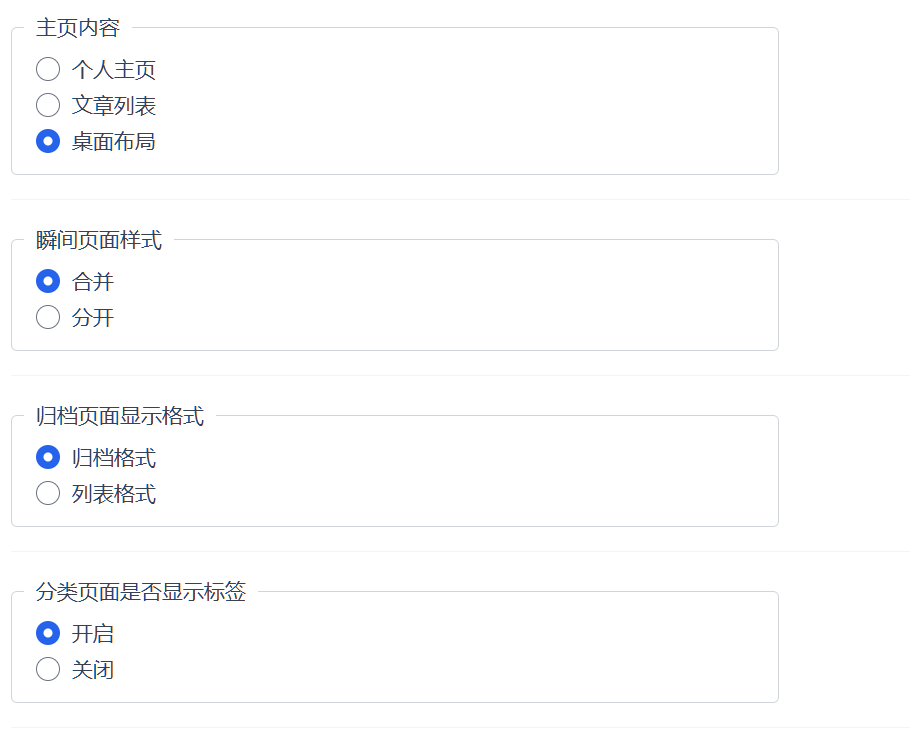

# halo-theme-daisym

## 预览地址
* [elapse.cc](https://elapse.cc)

## 配置修改

## （可选）自由拖动首页

## （可选）个人介绍首页

## steam 插件适配

## 相册适配

## 所用插件
- ByteMD
- lightgallery.js 灯箱
- 图库管理
- 瞬间
- 链接管理
- 站点迁移
- 搜索组件
- RSS
- 评论组件
- steam

## 1.0主要修改内容
- 模板引擎调整为 thymeleaf 适配 halo2.0
- 重写文章归档页面
- 可配置标签是否在分类页面显示
- 添加了文章快速编辑按钮
- 文章内容页面修改
- 添加置顶文章的图标
- 添加文章目录功能
- 个人主页设置修改

## 1.1主要修改内容
- 添加两种瞬间显示（原日志） 可在主题页面配置
- 添加最新评论模块
- 修复摘要问题

## 新增功能
- 图库页面
- 自定义页面模板

## 2.0主要修改内容
- 添加steam适配
- 添加自由拖拽首页
- 修复归档页面
- 添加tailwindcss
- css js 等资源内置
## 配置

### 社交资料

填写 github/wechat 等社交链接，正确填写会在首页有对应图标显示

### 链接

基于 https://github.com/halo-sigs/plugin-links

### 主题设置

* 默认开启局部刷新

## 页面

主题配置中，侧边栏选项可以选择是否开启各个子块

参考  https://github.com/liaocp666/halo-theme-daisy